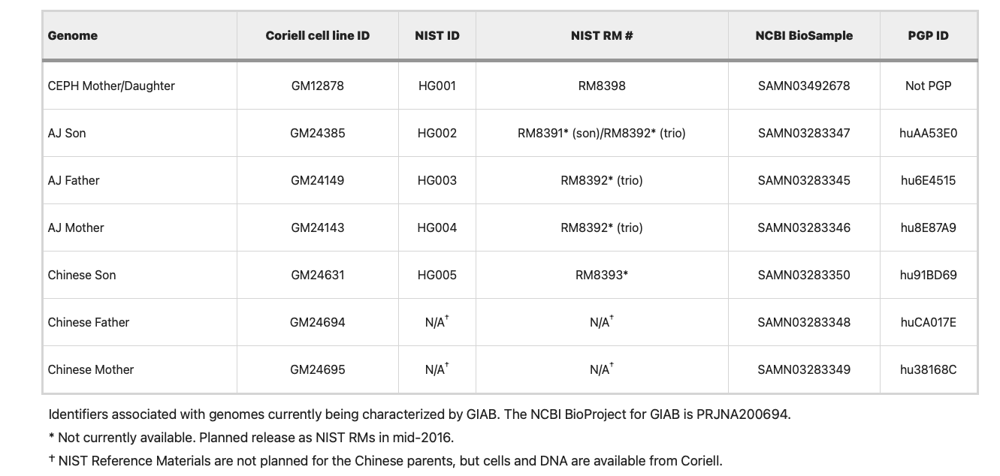

1.  **人类标准参考基因组标准品VCF下载来自:genome-in-a-bottle**

    The latest release for NA12878_HG001 is under:
    ```{.cs}
    https://ftp-trace.ncbi.nlm.nih.gov/ReferenceSamples/giab/release/NA12878_HG001/latest
     ```
    The latest releases for AshkenazimTrio are under:
    ```{.cs}
    https://ftp-trace.ncbi.nlm.nih.gov/ReferenceSamples/giab/release/AshkenazimTrio/HG002_NA24385_son/latest
    https://ftp-trace.ncbi.nlm.nih.gov/ReferenceSamples/giab/release/AshkenazimTrio/HG003_NA24149_father/latest
    https://ftp-trace.ncbi.nlm.nih.gov/ReferenceSamples/giab/release/AshkenazimTrio/HG004_NA24143_mother/latest
    ```
    The latest releases for ChineseTrio HG005_NA24631_son is under:
    ```{.cs}
    https://ftp-trace.ncbi.nlm.nih.gov/ReferenceSamples/giab/release/ChineseTrio/HG005_NA24631_son/latest
    https://ftp-trace.ncbi.nlm.nih.gov/ReferenceSamples/giab/release/ChineseTrio/HG006_NA24694_father/latest
    https://ftp-trace.ncbi.nlm.nih.gov/ReferenceSamples/giab/release/ChineseTrio/HG007_NA24695_mother/latest
    ```
    文件下载链接：
            https://ftp.ncbi.nlm.nih.gov/ReferenceSamples/giab/release/

    备注：只基于GRch37与GRch38版本对应的VCF和bed文件，截止2023.12最新版本为NISTv4.2.1
2.  **人类标准参考基因组标准品VCF下载来自：PlatinumGenomes(Illumina)**

    2017-1.0.file:
    https://github.com/Illumina/PlatinumGenomes/blob/master/files/2017-1.0.files
    ```{.cs}
    https://s3.eu-central-1.amazonaws.com/platinum-genomes/2017-1.0/ReleaseNotes.txt
    https://s3.eu-central-1.amazonaws.com/platinum-genomes/2017-1.0/hg19/hybrid/README.md
    https://s3.eu-central-1.amazonaws.com/platinum-genomes/2017-1.0/hg19/hybrid/hg19.hybrid.bed.gz
    https://s3.eu-central-1.amazonaws.com/platinum-genomes/2017-1.0/hg19/hybrid/hg19.hybrid.bed.gz.tbi
    https://s3.eu-central-1.amazonaws.com/platinum-genomes/2017-1.0/hg19/hybrid/hg19.hybrid.vcf.gz
    https://s3.eu-central-1.amazonaws.com/platinum-genomes/2017-1.0/hg19/hybrid/hg19.hybrid.vcf.gz.tbi
    https://s3.eu-central-1.amazonaws.com/platinum-genomes/2017-1.0/hg19/small_variants/ConfidentRegions.bed.gz
    https://s3.eu-central-1.amazonaws.com/platinum-genomes/2017-1.0/hg19/small_variants/ConfidentRegions.bed.gz.tbi
    https://s3.eu-central-1.amazonaws.com/platinum-genomes/2017-1.0/hg19/small_variants/NA12877/NA12877.vcf.gz
    https://s3.eu-central-1.amazonaws.com/platinum-genomes/2017-1.0/hg19/small_variants/NA12877/NA12877.vcf.gz.tbi
    https://s3.eu-central-1.amazonaws.com/platinum-genomes/2017-1.0/hg19/small_variants/NA12878/NA12878.vcf.gz
    https://s3.eu-central-1.amazonaws.com/platinum-genomes/2017-1.0/hg19/small_variants/NA12878/NA12878.vcf.gz.tbi
    https://s3.eu-central-1.amazonaws.com/platinum-genomes/2017-1.0/hg38/hybrid/README.md
    https://s3.eu-central-1.amazonaws.com/platinum-genomes/2017-1.0/hg38/hybrid/hg38.hybrid.bed.gz
    https://s3.eu-central-1.amazonaws.com/platinum-genomes/2017-1.0/hg38/hybrid/hg38.hybrid.bed.gz.tbi
    https://s3.eu-central-1.amazonaws.com/platinum-genomes/2017-1.0/hg38/hybrid/hg38.hybrid.vcf.gz
    https://s3.eu-central-1.amazonaws.com/platinum-genomes/2017-1.0/hg38/hybrid/hg38.hybrid.vcf.gz.tbi
    https://s3.eu-central-1.amazonaws.com/platinum-genomes/2017-1.0/hg38/small_variants/ConfidentRegions.bed.gz
    https://s3.eu-central-1.amazonaws.com/platinum-genomes/2017-1.0/hg38/small_variants/ConfidentRegions.bed.gz.tbi
    https://s3.eu-central-1.amazonaws.com/platinum-genomes/2017-1.0/hg38/small_variants/NA12877/NA12877.vcf.gz
    https://s3.eu-central-1.amazonaws.com/platinum-genomes/2017-1.0/hg38/small_variants/NA12877/NA12877.vcf.gz.tbi
    https://s3.eu-central-1.amazonaws.com/platinum-genomes/2017-1.0/hg38/small_variants/NA12878/NA12878.vcf.gz
    https://s3.eu-central-1.amazonaws.com/platinum-genomes/2017-1.0/hg38/small_variants/NA12878/NA12878.vcf.gz.tbi
    https://s3.eu-central-1.amazonaws.com/platinum-genomes/2017-1.0/md5sum.txt
    ```

3.  **比较工具Haplotype Comparison Tools**

    [Illumina/hap.py:https://github.com/Illumina/hap.py](https://github.com/Illumina/hap.py)

    建议使用docker版本

4.  **demo命令**
    ```{.cs}
    
    docker run -v /staging/WGS_demo/:/tmp/ pkrusche/hap.py /opt/hap.py/bin/hap.py \
    /tmp/NA12878.vcf.gz /tmp/test.vcf.gz \
    -o /tmp/hap/Rep17_10 -r /tmp/hg19.fa \
    --threads 40 -f /tmp/ConfidentRegions.bed.gz
    
    参数说明：
    
    -f FP_BEDFILE, --false-positives FP_BEDFILE
                        False positive / confident call regions (.bed or
                        .bed.gz). Calls outside these regions will be labelled
                        as UNK.
    ```
5.  **分层Stratifications**

    参考链接：https://github.com/genome-in-a-bottle/genome-stratifications
    
    Stratifications can be binned into seven types: Low Complexity, Functional Technically Difficult, Genome Specific, Functional Regions, GC content, mappability, Other Difficult, Segmental Duplications, Union, Ancestry and XY. General information for stratification types are provided below. Associated stratification READMEs provide more information on what the individual files cover and represent.

    **Low Complexity**

    GRCh37 (28 stratifications), GRCh38 (28 stratifications) and CHM13v2.0 (27 stratifications)

    Regions with different types and sizes of low complexity sequence, e.g., homopolymers, STRs, VNTRs and other locally repetitive sequences.
    
    **Other Difficult**

    GRCh37 (11 stratifications), GRCh38 (13 stratifications) and CHM13v2.0 (1 stratification)

    Highly variable regions like the VDJ and MHC, near gaps in the reference or errors in the reference and rDNA (CHM13 only).
    
    **Segmental Duplications**

    GRCh37 (9 stratifications), GRCh38 (9 stratifications), CHM13v2.0 (2 stratifications)

    Regions with segmental duplications or regions with non-trivial self-chain alignments.
    
    **Union**

    GRCh37 (4 stratifications), GRCh38 (4 stratifications), CHM13v2.0 (2 stratifications)

    Regions with different general types of difficult regions or any type o difficult region or complex variant. For example, performance can be measured in just "easy" or "all difficult" regions of the genome.
    
    **XY**

    GRCh37 (9 stratifications), GRCh38 (9 stratifications), CHM13v2.0 (7 stratifications) Chomosome XY specific regions such as PAR, XTR or ampliconic.
    
    **Functional Technically Difficult**

    GRCh37 (3 stratifications) and GRCh38 (3 stratifications)

    Functional, or potentially functional, regions that are also likely to be technically difficult to sequences.
    
    **Genome Specific (GIAB benchmark v4.2.1)**

    GRCh37 (90 stratifications) and GRCh38 (90 stratifications)

    Difficult regions due to potentially difficult variation in a NIST/GIAB sample, including 1) regions containing putative compound heterozygous variants 2) small regions containing multiple phased variants, 3) regions with potential structural or copy number variation.
    
    **Functional Regions**

    GRCh37 (2 stratifications) and GRCh38 (2 stratifications)

    Regions to stratify variants inside and outside coding regions.
    
    **GC Content**

    GRCh37 (14 stratifications) and GRCh38 (14 stratifications)

    Regions with different ranges (%) of GC content.
    
    **Mappability**

    GRCh37 (4 stratifications) and GRCh38 (4 stratifications)

    Regions where short read mapping can be challenging.
    
    **Ancestry**

    GRCh38 only (6 stratifications)

    Regions with inferred patterns of local ancestry.

6.  **参考文献**

    [Wagner J, Olson N D, Harris L, et al. Benchmarking challenging small variants with linked and long reads[J]. Cell Genomics, 2022, 2(5).](https://www.cell.com/cell-genomics/pdf/S2666-979X(22)00057-X.pdf)

    [Zook J M, McDaniel J, Olson N D, et al. An open resource for accurately benchmarking small variant and reference calls[J]. Nature biotechnology, 2019, 37(5): 561-566.](https://www.nature.com/articles/s41587-019-0074-6)

    [Olson N D, Wagner J, Dwarshuis N, et al. Variant calling and benchmarking in an era of complete human genome sequences[J]. Nature Reviews Genetics, 2023: 1-20.](https://www.nature.com/articles/s41576-023-00590-0)

    [Krusche P, Trigg L, Boutros P C, et al. Best practices for benchmarking germline small-variant calls in human genomes[J]. Nature biotechnology, 2019, 37(5): 555-560.](https://www.nature.com/articles/s41587-019-0054-x)
    
    [Ha Y J, Kang S, Kim J, et al. Comprehensive benchmarking and guidelines of mosaic variant calling strategies[J]. Nature Methods, 2023, 20(12): 2058-2067.](https://www.nature.com/articles/s41592-023-02043-2)

7.  **SV变异检测性能评估**

    7-1 基于GRch37版本HG002真集下载：

    https://ftp-trace.ncbi.nlm.nih.gov/ReferenceSamples/giab/data/AshkenazimTrio/analysis/NIST_SVs_Integration_v0.6/
    
    7-2：基于GRch38版本HG002的SV真集（但仅限于医学相关的几个基因）

    Challenging Medically-Relevant Genes Benchmark Set：https://data.nist.gov/od/id/mds2-2475

    https://ftp-trace.ncbi.nlm.nih.gov/giab/ftp/release/AshkenazimTrio/HG002_NA24385_son/CMRG_v1.00/GRCh38/StructuralVariant/

    [Wagner, Justin, et al. "Curated variation benchmarks for challenging medically relevant autosomal genes." Nature biotechnology 40.5 (2022): 672-680.](https://www.nature.com/articles/s41587-021-01158-1)

    7-3 评测工具

    witty.er: https://github.com/Illumina/witty.er
       
      or

    truvari:  https://github.com/ACEnglish/truvari

    7-4 命令行示例

    ```{.cs}
    Wittyer.dll -i <input_vcf> -t HG002_SVs_Tier1_v0.6.vcf.gz --includeBed HG002_SVs_Tier1_v0.6.bed --configFile config_wittyer.json -em SimpleCounting -o <out_file>
    or
    truvari.py -b HG002_SVs_Tier1_v0.6.vcf.gz -c your.vcf.gz -o yourvcfvsGIABv0.6 --passonly --includebed HG002_SVs_Tier1_v0.6.bed -r 2000 --giabreport
    ```
    
    7-5 参考文献

    [Cameron D L, Di Stefano L, Papenfuss A T. Comprehensive evaluation and characterisation of short read general-purpose structural variant calling software[J]. Nature communications, 2019, 10(1): 3240.](https://www.nature.com/articles/s41467-019-11146-4)

    [Wagner J, Olson N D, Harris L, et al. Benchmarking challenging small variants with linked and long reads[J]. Cell Genomics, 2022, 2(5).](https://www.cell.com/cell-genomics/pdf/S2666-979X(22)00057-X.pdf)

    [Behera S, Catreux S, Rossi M, et al. Comprehensive and accurate genome analysis at scale using DRAGEN accelerated algorithms[J]. bioRxiv, 2024: 2024.01. 02.573821.](https://www.biorxiv.org/content/10.1101/2024.01.02.573821v1)

    [Zook J M, Hansen N F, Olson N D, et al. A robust benchmark for detection of germline large deletions and insertions[J]. Nature biotechnology, 2020, 38(11): 1347-1355.](https://www.nature.com/articles/s41587-020-0640-y)

    [English A C, Menon V K, Gibbs R A, et al. Truvari: refined structural variant comparison preserves allelic diversity[J]. Genome Biology, 2022, 23(1): 271.](https://link.springer.com/article/10.1186/s13059-022-02840-6)

    [Seeking Truth: Solving CNV Evaluation Challenges with T2T Genome Assembly](https://broadclinicallabs.org/seeking-truth-solving-cnv-evaluation-challenges-with-t2t-genome-assembly/)

    7-6 SV建议call变异的方法，参考以下文献

    Jun G, English A C, Metcalf G A, et al. Structural variation across 138,134 samples in the TOPMed consortium[J]. bioRxiv, 2023.

    可以使用Manta, Delly, Lumpy, Breakseq, and CNVnator等独立的分析软件，然后使用SURVIVOR软件将结果merge(1kb范围内的)，SV注释可以使用AnnotSV

8.  **Related links**

    GA4GH/GIAB stratifications: https://github.com/genome-in-a-bottle/genome-stratifications

    Genome in a Bottle Consortium: http://www.genomeinabottle.org/

    gnomAD: https://gnomad.broadinstitute.org/

    Human Pangenome Reference Consortium: https://humanpangenome.org/

    T2T-CHM13: https://github.com/marbl/CHM13

9. 标准品家系普

