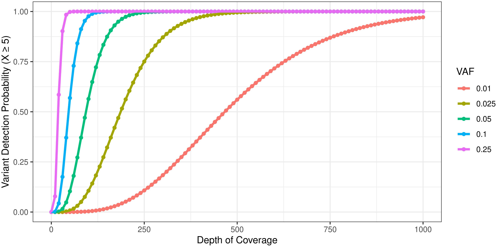
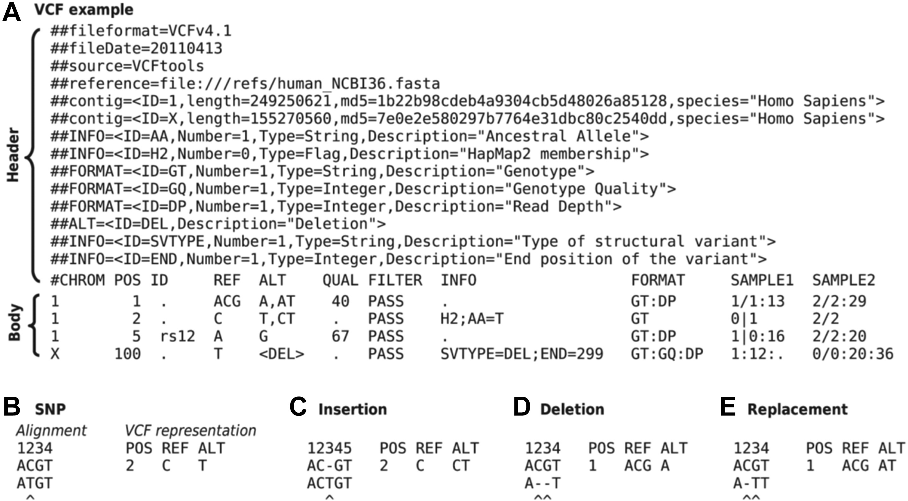
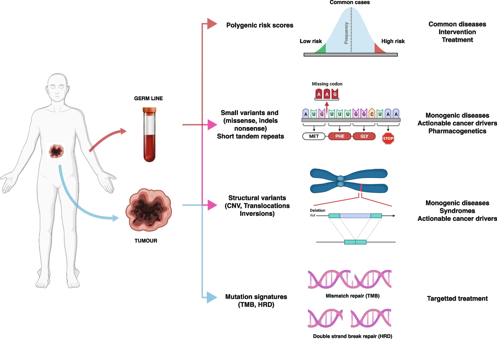

# 生信资源

[菜鸟教程:https://www.runoob.com](https://www.runoob.com)

[R语言学习资源:Cookbook for R](http://www.cookbook-r.com)

[R语言学习资源:tidyverse](https://www.tidyverse.org/)

[R语言学习资源:ggplot2](https://ggplot2-book.org)

[R绘制热图heatmap](https://flowingdata.com/2010/01/21/how-to-make-a-heatmap-a-quick-and-easy-solution/)

[RColorBrewer画图颜色选择](http://colorbrewer2.org/)

[python学习在线资源:Cookbook for python](http://python3-cookbook.readthedocs.io/zh_CN/latest/index.html)

[Python-100-Days](https://github.com/jackfrued/Python-100-Days)

[编程学习:廖雪峰的官方网站](https://www.liaoxuefeng.com)

[Basic-Machine-Learning-Algorithms](https://github.com/weizhixiaoyi/Basic-Machine-Learning-Algorithms)

[文献下载网站:GeenMedical](https://www.geenmedical.com)

[书籍下载鸠摩搜索](https://www.jiumodiary.com)

[在线Markdown简单实用说明:Markdown](https://commonmark.org/help/)

[markdown user guide](https://dillinger.io/)

[变异位点命名:Mutalyzer](https://mutalyzer.nl)

[变异位点命名:VariantValidator](https://variantvalidator.org)

[ACMG中文指南](http://acmg.cbgc.org.cn/doku.php?id=start)

[Memorial Sloan Kettering Cancer Center (MSK)OncoKB: A Precision Oncology Knowledge Base](https://www.oncokb.org/)

[medicalxpress](https://medicalxpress.com/)

[genomeweb](https://www.genomeweb.com/)

[测序中国](https://www.seqchina.cn/)

[github中文排行榜](https://github.com/kon9chunkit/GitHub-Chinese-Top-Charts)

[清华大学开源软件镜像站](https://mirrors.tuna.tsinghua.edu.cn/)

[命名标准化HGNC:https://www.genenames.org](https://www.genenames.org)

[GeneCards:https://www.genecards.org](GeneCards)

[变异位点命名:Mutalyzer](https://mutalyzer.nl)

[变异位点命名:VariantValidator](https://variantvalidator.org)

[序列重比对:abra2](https://github.com/mozack/abra2)

[文档转化Pandoc a universal document converter](https://pandoc.org/index.html)

[pdf2word](https://www.hipdf.cn)

[表格转换工具：markdown-json-reStructuredText](https://tableconvert.com/zh-cn/)

[conda](./conda/README.md)

# Inner_link:本地链接

- [pandoc-markdown2pdf文档转化](./pandoc-markdown2pdf/README.md)
- [UCSC](./UCSC/README.md)
- [GATK](./GATK/README.md)
- [Linux](./Linux/README.md)
- [python3](./python3/README.md)
- [R语言](./R/README.md)
- [Metagenomic](./metagenomics/README.md)
- [Benchmark_SNV_CNV_SV](./Benchmark_SNV_CNV_SV/README.md)
- [sample_qc](./sample_qc/README.md)
- [SAM_VCF](./SAM_VCF/README.md)
- [somatic](./somatic/README.md)
- [germline](./germline/README.md)
- [ACMG_AMP_SCCO_CAP](./ACMG_AMP_ASCO_CAP/README.md)
- [silico数据模拟](./Silico/README.md)
- [Genome in a Bottle Consortium Genomes](./GIAB/README.md)
- [Mac电脑](./MAC/README.md)
- [low pass WGS](./low_pass_WGS/README.md)
- [single cell单细胞](./single_cell/README.md)
- [small RNA](./small_RNA/)
- [methylation](./methylation/)
- [TMB_MSI](./TMB_MSI/)
- [HRD](./HRD/README.md)
- [T2T-CHM13_GRCh38](./T2T-CHM13_GRCh38/README.md)

# out_link:

[GA4GH/GIAB stratifications: https://github.com/genome-in-a-bottle/genome-stratifications](https://github.com/genome-in-a-bottle/genome-stratifications)

[Genome in a Bottle Consortium: http://www.genomeinabottle.org/]( http://www.genomeinabottle.org/)

[gnomAD: https://gnomad.broadinstitute.org/](https://gnomad.broadinstitute.org/)

[Human Pangenome Reference Consortium: https://humanpangenome.org/](https://humanpangenome.org/)

[T2T-CHM13: https://github.com/marbl/CHM13](https://github.com/marbl/CHM13)

[GWASLab–GWAS实验室](https://gwaslab.org/)

# Online Knowledge Bases to Aid Clinical Decision Making

[My Cancer Genome:www.mycancergenome.org](www.mycancergenome.org)

[JAX Clinical Knowledgebase:https://ckb.jax.org](https://ckb.jax.org)

[Clinical Interpretation of Variants in Cancer:https://civic.genome.wustl.edu](https://civic.genome.wustl.edu)

[Oncology Knowledge Base:https://oncokb.org](https://oncokb.org)

[Clinical Genome:https://clinicalgenome.org](https://clinicalgenome.org)

# Variant and Mutation Databases

[COSMIC: https://cancer.sanger.ac.uk/cosmic](https://cancer.sanger.ac.uk/cosmic)

[HGMD: http://www.hgmd.cf.ac.uk/ac/index.php](http://www.hgmd.cf.ac.uk/ac/index.php)

[ClinVar: https://www.ncbi.nlm.nih.gov/clinvar/](https://www.ncbi.nlm.nih.gov/clinvar/)

[1000 Genomes: https://www.internationalgenome.org/](https://www.internationalgenome.org/)

[GWAS Catalog: https://www.ebi.ac.uk/gwas/](https://www.ebi.ac.uk/gwas/)

# other

1.  **Illustration of relationship between sequencing depth and variant call confidence as a function of VAF.**

2.  **Example of a valid VCF file with header and a few variant site records.**

3.  **For hot spot testing, coverage of at least 100–300X is recommended.**

4.  **Whole Genome Sequencing (WGS) finds its primary clinical applications in diagnosing rare diseases and pinpointing actionable somatic variants within tumors.**

