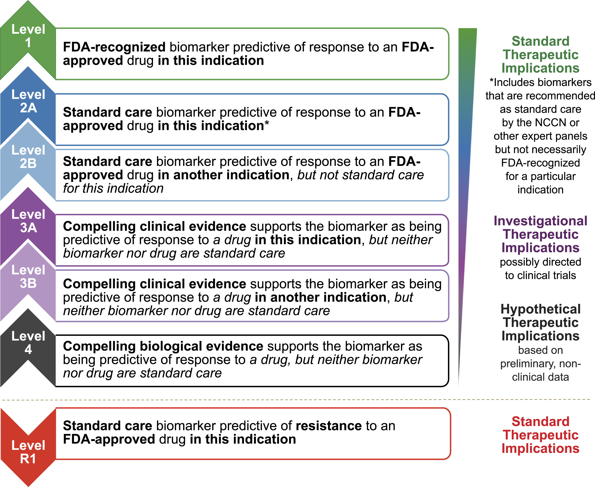

# 生信资源

[菜鸟教程:https://www.runoob.com](https://www.runoob.com)

[R语言学习资源:Cookbook for R ](http://www.cookbook-r.com)

[R语言学习资源:tidyverse ](https://www.tidyverse.org/)

[python学习在线资源:Cookbook for python ](http://python3-cookbook.readthedocs.io/zh_CN/latest/index.html)

[文献下载网站:GeenMedical ](https://www.geenmedical.com)

[书籍下载：鸠摩搜索 ](https://www.jiumodiary.com)

[在线Markdown简单实用说明:Markdown ](https://commonmark.org/help/)

[变异位点命名:Mutalyzer ](https://mutalyzer.nl)

[变异位点命名:VariantValidator ](https://variantvalidator.org)

[ACMG中文指南 ](http://acmg.cbgc.org.cn/doku.php?id=start)

[Memorial Sloan Kettering Cancer Center (MSK)的精准肿瘤学知识库 OncoKB: A Precision Oncology Knowledge Base ](https://www.oncokb.org/)

[medicalxpress ](https://medicalxpress.com/)

[genomeweb ](https://www.genomeweb.com/)

[测序中国 ](https://www.seqchina.cn/)

[github中文排行榜 ](https://github.com/kon9chunkit/GitHub-Chinese-Top-Charts)

[Pycharm软件激活 ](https://www.ajihuo.com/)

[清华大学开源软件镜像站 ](https://mirrors.tuna.tsinghua.edu.cn/)

[命名标准化HGNC:https://www.genenames.org ](https://www.genenames.org)

[GeneCards:https://www.genecards.org ](GeneCards)

[变异位点命名:Mutalyzer ](https://mutalyzer.nl)

[变异位点命名:VariantValidator ](https://variantvalidator.org)

[序列重比对abra2 ](https://github.com/mozack/abra2)

[文档转化Pandoc a universal document converter ](https://pandoc.org/index.html)

# Inner_link:本地链接

- [UCSC](./UCSC/README.md)
- [GATK](./GATK/README.md)
- [Linux学习](./Linux/README.md)
- [python3学习](./python3/README.md)
- [Metagenomic宏基因组](./metagenomics/README.md)
- [Benchmark_SNV_CNV_SV](./Benchmark_SNV_CNV_SV/README.md)
- [somatic:体细胞突变](./somatic/README.md)
- [germline:胚系突变](./germline/README.md)
- [GWAS研究资源](./GWAS/README.md)
- [ACMG_AMP_SCCO_CAP](./ACMG_AMP_ASCO_CAP/README.md)
- [silico数据模拟](./Silico/README.md)
- [bioinforamtic documents](./README.md)
- [Genome in a Bottle Consortium Genomes](./GIAB/README.md)
- [Mac电脑](./MAC/README.md)

# out_link:

[GA4GH/GIAB stratifications: https://github.com/genome-in-a-bottle/genome-stratifications](https://github.com/genome-in-a-bottle/genome-stratifications)

[Genome in a Bottle Consortium: http://www.genomeinabottle.org/]( http://www.genomeinabottle.org/)

[gnomAD: https://gnomad.broadinstitute.org/](https://gnomad.broadinstitute.org/)

[Human Pangenome Reference Consortium: https://humanpangenome.org/](https://humanpangenome.org/)

[T2T-CHM13: https://github.com/marbl/CHM13](https://github.com/marbl/CHM13)

# Online Knowledge Bases to Aid Clinical Decision Making

[My Cancer Genome:www.mycancergenome.org ](www.mycancergenome.org)

[JAX Clinical Knowledgebase:https://ckb.jax.org ](https://ckb.jax.org)

[Clinical Interpretation of Variants in Cancer:https://civic.genome.wustl.edu> ](https://civic.genome.wustl.edu)

[Oncology Knowledge Base:https://oncokb.org ](https://oncokb.org)

[Clinical Genome:https://clinicalgenome.org ](https://clinicalgenome.org)

# other

1. Illustration of relationship between sequencing depth and variant call confidence as a function of VAF.

2.  Example of a valid VCF file with header and a few variant site records.

3.  For hot spot testing, coverage of at least 100–300X is recommended.

4. Example of Hierarchy of Evidence of Genomic Alterations

