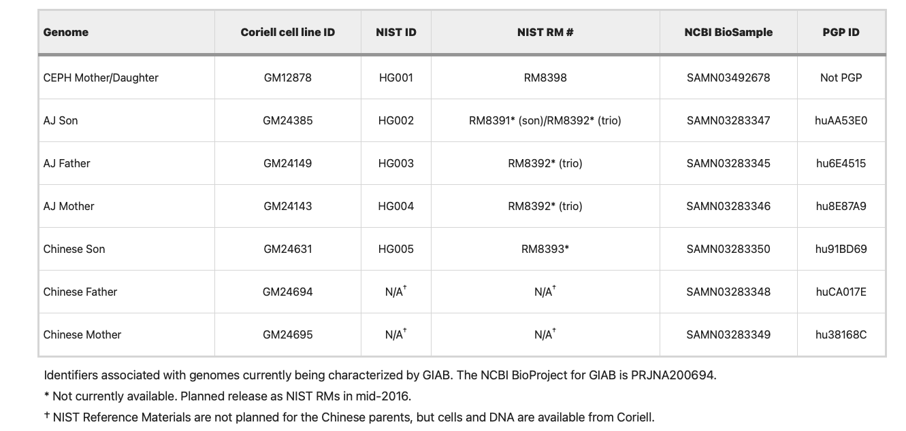

生信资源
======================

`菜鸟教程:https://www.runoob.com <https://www.runoob.com>`_

`R语言学习资源:Cookbook for R <http://www.cookbook-r.com>`_

`python学习在线资源:Cookbook for python <http://python3-cookbook.readthedocs.io/zh_CN/latest/index.html>`_

`文献下载网站:GeenMedical <https://www.geenmedical.com>`_

`书籍下载：鸠摩搜索 <https://www.jiumodiary.com>`_

`在线Markdown简单实用说明:Markdown <https://commonmark.org/help/>`_

`变异位点命名:Mutalyzer <https://mutalyzer.nl>`_

`变异位点命名:VariantValidator <https://variantvalidator.org>`_

`ACMG中文指南 <http://acmg.cbgc.org.cn/doku.php?id=start>`_

`Memorial Sloan Kettering Cancer Center (MSK)的精准肿瘤学知识库 OncoKB: A Precision Oncology Knowledge Base <https://www.oncokb.org/>`_

`medicalxpress <https://medicalxpress.com/>`_

`genomeweb <https://www.genomeweb.com/>`_

`测序中国 <https://www.seqchina.cn/>`_

`github中文排行榜 <https://github.com/kon9chunkit/GitHub-Chinese-Top-Charts>`_

命名标准化
=====================

`HGNC:https://www.genenames.org <https://www.genenames.org>`_

`GeneCards:https://www.genecards.org <GeneCards>`_

`变异位点命名:Mutalyzer <https://mutalyzer.nl>`_

`变异位点命名:VariantValidator <https://variantvalidator.org>`_

序列重比对
==================
`abra2 <https://github.com/mozack/abra2>`_

UCSC资源
===================

`For hg19:http://hgdownload.soe.ucsc.edu/goldenPath/hg19/bigZips/latest/ <http://hgdownload.soe.ucsc.edu/goldenPath/hg19/bigZips/latest/>`_

`For hg38:http://hgdownload.soe.ucsc.edu/goldenPath/hg38/bigZips/latest/ <http://hgdownload.soe.ucsc.edu/goldenPath/hg38/bigZips/latest/>`_

`https://hgdownload.cse.ucsc.edu/admin/exe/linux.x86_64/ <https://hgdownload.cse.ucsc.edu/admin/exe/linux.x86_64/>`_

Metagenomic
======================

`Kraken Wiki:https://github.com/DerrickWood/kraken2/wiki <https://github.com/DerrickWood/kraken2/wiki>`_

`Kraken index: https://benlangmead.github.io/aws-indexes/k2 <https://benlangmead.github.io/aws-indexes/k2>`_

`FDA-ARGOS is a database with public quality-controlled reference genomes for diagnostic use and regulatory science <https://www.ncbi.nlm.nih.gov/bioproject/231221>`_

Linux
===============

`Packages for Linux and Unix:https://pkgs.org/ <https://pkgs.org/>`_

文档转化
=================

`Pandoc a universal document converter <https://pandoc.org/index.html>`_

安装python3
====================
::

    mkdir -p /usr/local/openssl/
    cd /software/ && tar -zxvf openssl-1.1.1m.tar.gz
    cd /software/openssl-1.1.1m/ && ./config --prefix=/usr/local/openssl
    make -j20
    make install
    mv /usr/bin/openssl /usr/bin/openssl.old
    mv /usr/lib64/openssl /usr/lib64/openssl.old
    ln -s /usr/local/openssl/bin/openssl /usr/bin/openssl
    ln -s /usr/local/openssl/include/openssl /usr/include/openssl
    echo "/usr/local/openssl/lib" >> /etc/ld.so.conf
    ldconfig -v
    RUN cd /software/python3 && tar xvf Python-3.10.5.tgz && cd Python-3.10.5 && ./configure --prefix=/software/python3/Python-v3.10.5 --with-openssl=/usr/local/openssl && make -j20 && make install

关于liftover
===================

**UCSC chain files**

    Chain files from hs1 (T2T-CHM13) to hg38/hg19/mm10/mm9 (ore vice versa): https://hgdownload.soe.ucsc.edu/goldenPath/hs1/liftOver/

    Chain files from hg38 (GRCh38) to hg19 and all other organisms: http://hgdownload.soe.ucsc.edu/goldenPath/hg38/liftOver/

    Chain File from hg19 (GRCh37) to hg17/hg18/hg38 and all other organisms: http://hgdownload.soe.ucsc.edu/goldenPath/hg19/liftOver/

**Ensembl chain files**

    Human to Human: http://ftp.ensembl.org/pub/assembly_mapping/homo_sapiens/
**Tools**

CrossMap:https://crossmap.sourceforge.net/

picard:https://gatk.broadinstitute.org/hc/en-us/articles/360037060932-LiftoverVcf-Picard- ::

    java -jar picard.jar LiftoverVcf \\
     I=input.vcf \\
     O=lifted_over.vcf \\
     CHAIN=b37tohg38.chain \\
     REJECT=rejected_variants.vcf \\
     R=reference_sequence.fasta
     其中The reference sequence (fasta) for the TARGET genome build

Genomic Data Commons (GDC) Data User’s Guide_bioinformatic
==========================================================================

`Genomic Data Commons (GDC) Data User’s Guide_bioinformatic.pdf <https://docs.gdc.cancer.gov/Data_Portal/PDF/Data_Portal_UG.pdf>`_

GATK资源下载
====================

参考链接 https://gatk.broadinstitute.org/hc/en-us/articles/360035890811-Resource-bundle

genomics-public-data
+++++++++++++++++++++++++++
https://console.cloud.google.com/storage/browser/genomics-public-data

Description: The buckets contain an assortment of reference, resource, and sample test data which can be used in GATK workflows.

gcp-public-data--broad-references
+++++++++++++++++++++++++++++++++++++
https://console.cloud.google.com/storage/browser/gcp-public-data--broad-references

Description: This is the Broad's public hg38 and b37 reference and resource data.Example workspaces include:**Whole-Genome-Analysis-Pipeline,GATK4-Germline-Preprocessing-VariantCalling-JointCalling**

gatk-legacy-bundles
+++++++++++++++++++++++++++++++++++
https://console.cloud.google.com/storage/browser/gatk-legacy-bundles

Description: Broad public legacy b37 and hg19 reference and resource data.

broad-public-datasets
+++++++++++++++++++++++++++++++++++
https://console.cloud.google.com/storage/browser/broad-public-datasets

Description: Stores public test data, often used to test workflows. For example, it contains NA12878 CRAM, gVCF, and unmapped BAM files.

gatk-best-practices
+++++++++++++++++++++++++++++++++++
https://console.cloud.google.com/storage/browser/gatk-best-practices

Description: Stores GATK workflow specific plumbing, reference, and resources data. Example workspaces include:**Somatic-SNVs-Indels-GATK4**

gatk-test-data
+++++++++++++++++++++++++++++++++++
https://console.cloud.google.com/storage/browser/gatk-test-data

Description: Additional public test data focusing on smaller data sets. For example, whole genome BAM, FASTQ, gVCF, VCF, etc. Example Workspaces include:**Somatic-CNVs-GATK4**

人类参考基因组说明Human genome reference builds
++++++++++++++++++++++++++++++++++++++++++++++++++++++++++++++++++++++
https://gatk.broadinstitute.org/hc/en-us/articles/360035890951-Human-genome-reference-builds-GRCh38-or-hg38-b37-hg19

Genome in a Bottle Consortium Genomes
============================================================
`相关资源链接：https://github.com/genome-in-a-bottle <https://github.com/genome-in-a-bottle>`_

