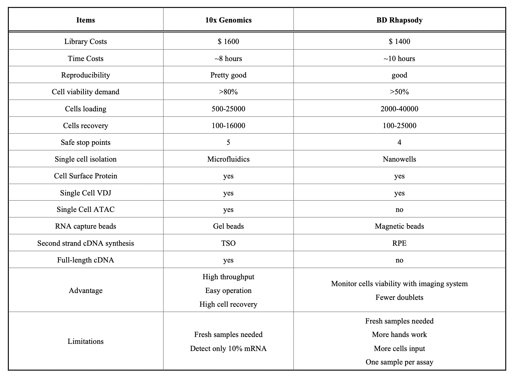

# 单细胞相关学习笔记

[单细胞测序工作流程_关键步骤和注意事项.pdf](./单细胞测序工作流程_关键步骤和注意事项.pdf)

[hg19_gtf:https://hgdownload.soe.ucsc.edu/goldenPath/hg19/bigZips/genes/](https://hgdownload.soe.ucsc.edu/goldenPath/hg19/bigZips/genes/)

[hg38_gtf:https://hgdownload.soe.ucsc.edu/goldenPath/hg38/bigZips/genes](https://hgdownload.soe.ucsc.edu/goldenPath/hg38/bigZips/genes)

[10x测序文库学习链接:https://teichlab.github.io/scg_lib_structs/methods_html/10xChromium3.html](https://teichlab.github.io/scg_lib_structs/methods_html/10xChromium3.html)

# 测序深度(10X)

```{.cs}
    

    Gene Expression                                     20,000 read pairs/ cell
    Immune profiling (VDJ)                              5,000 read pairs/ targeted cell
    Gene Expression with Feature Barcoding technology   Minimum 5,000 read pairs/cell
    ATACSeq                                             25,000 read pairs per nucleus (50,000 individual reads. 25,000 from R1, 25,000 from R2
    CNV                                                 750,000 read pairs per cell (for human) enables accurate detection of 2 Mb events per single cell
```

# 商业化两平台比较 BD Rhapsody vs 10x Genomics Chromium


# 降维方法

t-SNE与UMAP,UMAP计算速度快，适用于大细胞数量的样本

# 单细胞下游分析工具

[Weber C, Hirst M B, Ernest B, et al. SEQUIN is an R/Shiny framework for rapid and reproducible analysis of RNA-seq data[J]. Cell Reports Methods, 2023, 3(3).](https://www.cell.com/cell-reports-methods/pdf/S2667-2375(23)00031-0.pdf)