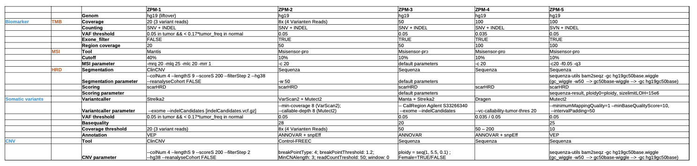

1.  **AACR Project GENIE**

    

    [AACR Project GENIE:https://www.synapse.org/#!Synapse:syn7222066/wiki/405659](https://www.synapse.org/#!Synapse:syn7222066/wiki/405659)

    [Suehnholz S P, Nissan M H, Zhang H, et al. Quantifying the Expanding Landscape of Clinical Actionability for Patients with Cancer[J]. Cancer Discovery, 2023.](https://aacrjournals.org/cancerdiscovery/article/doi/10.1158/2159-8290.CD-23-0467/729589)

2.  [GDC DNA-Seq analysis pipeline](https://docs.gdc.cancer.gov/Data/Bioinformatics_Pipelines/DNA_Seq_Variant_Calling_Pipeline/)

    **DNA-Seq analysis is implemented across six main procedures**

        Genome Alignment
        Alignment Co-Cleaning
        Somatic Variant Calling
        Variant Annotation
        Mutation Aggregation
        Aggregated Mutation Masking

3.  [Menzel M, Ossowski S, Kral S, et al. Multicentric pilot study to standardize clinical whole exome sequencing (WES) for cancer patients[J]. NPJ Precision Oncology, 2023, 7(1): 106.](https://www.nature.com/articles/s41698-023-00457-x)

    
 
4.  [Cortés-Ciriano I, Gulhan D C, Lee J J K, et al. Computational analysis of cancer genome sequencing data[J]. Nature Reviews Genetics, 2022, 23(5): 298-314.](https://www.nature.com/articles/s41576-021-00431-y)

5.  **1000 Genomes Project**

    Details of the analyses and the pipeline can be found at https://ftp.1000genomes.ebi.ac.uk/vol1/ftp/data_collections/1000G_2504_high_coverage/20190405_NYGC_b38_pipeline_description.pdf
