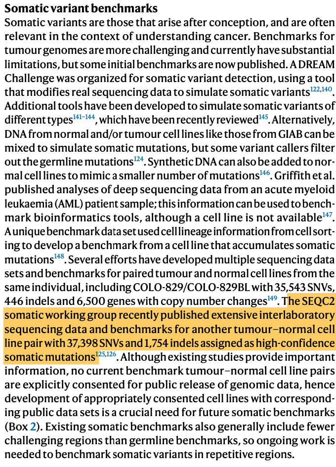
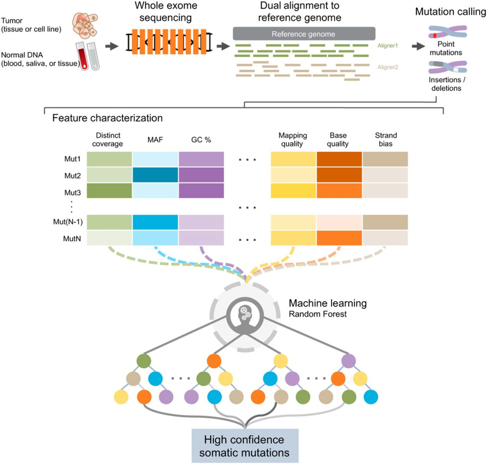
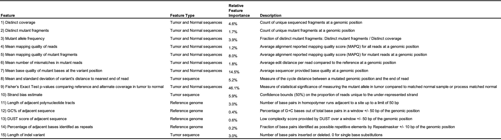

0. **Somatic variant benchmarks**

   

   [Olson N D, Wagner J, Dwarshuis N, et al. Variant calling and benchmarking in an era of complete human genome sequences[J]. Nature Reviews Genetics, 2023: 1-20.](https://www.nature.com/articles/s41576-023-00590-0)

1. **Download HCC1395BL Hg38 reference**

    [https://ftp-trace.ncbi.nlm.nih.gov/ReferenceSamples/seqc/Somatic_Mutation_WG/assembly/HCC1395BL_v1.0/](https://ftp-trace.ncbi.nlm.nih.gov/ReferenceSamples/seqc/Somatic_Mutation_WG/assembly/HCC1395BL_v1.0)

    [Xiao C, Chen Z, Chen W, et al. Personalized genome assembly for accurate cancer somatic mutation discovery using tumor-normal paired reference samples[J]. Genome Biology, 2022, 23(1): 237.](https://genomebiology.biomedcentral.com/articles/10.1186/s13059-022-02803-x)

    [Xiao W, Ren L, Chen Z, et al. Toward best practice in cancer mutation detection with whole-genome and whole-exome sequencing[J]. Nature biotechnology, 2021, 39(9): 1141-1150.](https://www.nature.com/articles/s41587-021-00994-5)

    [Fang L T, Zhu B, Zhao Y, et al. Establishing community reference samples, data and call sets for benchmarking cancer mutation detection using whole-genome sequencing[J]. Nature biotechnology, 2021, 39(9): 1151-1160.](https://www.nature.com/articles/s41587-021-00993-6)

2. **a pair of tumor-normal reference samples (HCC1395 and HCC1395BL), along with the high-confidence somatic mutation call set**

    [https://ftp-trace.ncbi.nlm.nih.gov/ReferenceSamples/seqc/Somatic_Mutation_WG/release/latest/](https://ftp-trace.ncbi.nlm.nih.gov/ReferenceSamples/seqc/Somatic_Mutation_WG/release/latest/)

3. **文件说明**

    *1-based coordinate system*:SAM, VCF, GFF and Wiggle formats are using the 1-based coordinate system

    *0-based coordinate system*:BAM, BCFv2, BED, and PSL formats are using the 0-based coordinate system

4. **特征提取**
   
   

    [Wood D E, White J R, Georgiadis A, et al. A machine learning approach for somatic mutation discovery[J]. Science translational medicine, 2018, 10(457): eaar7939.](https://www.science.org/doi/full/10.1126/scitranslmed.aar7939)

    

    4.1 **低复杂度序列**
    
    [Morgulis A, Gertz E M, Schäffer A A, et al. A fast and symmetric DUST implementation to mask low-complexity DNA sequences[J]. Journal of Computational Biology, 2006, 13(5): 1028-1040.](https://www.liebertpub.com/doi/abs/10.1089/cmb.2006.13.1028)
    
    程序ncbi-blast-2.15.0+/bin/dustmasker，默认windows:64 阈值：20(实际是2，这里是*10的结果)
    
    如果计算DUST score,有R包可以完成， [ShortRead](https://rdrr.io/bioc/ShortRead/man/dustyScore.html)的*dustyScore*函数，[universalmotif](https://rdrr.io/github/bjmt/universalmotif/)的*sequence_complexity*,
    还有[R453Plus1Toolbox](https://rdrr.io/bioc/R453Plus1Toolbox/man/complexity.dust.html)的*complexity.dust*函数，给出的是标准化0-100的结果，同时也给出了统计作图
    
    ```{.cs}
    fasta_file_path="/Users/yfan/Desktop/test.fasta"
    seqs=readDNAStringSet(fasta_file_path)
    
    #universalmotif(推荐)
    score =sequence_complexity(seqs,method = "DUST",window.size = 64)
    
    #ShortRead
    library(ShortRead)
    y=dustyScore(seqs)
    
    #R453Plus1Toolbox
    library(R453Plus1Toolbox)
    complexity.dust(seqs)
    ```
   