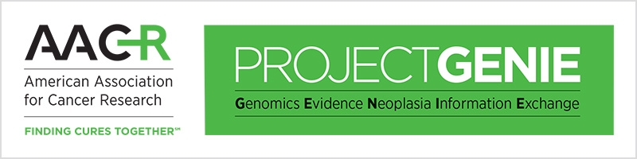
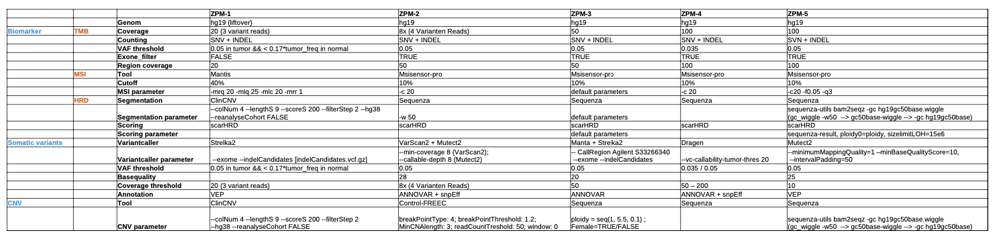

1.  **AACR Project GENIE**

    

    [AACR Project GENIE:https://www.synapse.org/#!Synapse:syn7222066/wiki/405659](https://www.synapse.org/#!Synapse:syn7222066/wiki/405659)

    [Suehnholz S P, Nissan M H, Zhang H, et al. Quantifying the Expanding Landscape of Clinical Actionability for Patients with Cancer[J]. Cancer Discovery, 2023.](https://aacrjournals.org/cancerdiscovery/article/doi/10.1158/2159-8290.CD-23-0467/729589)

2.  [GDC DNA-Seq analysis pipeline](https://docs.gdc.cancer.gov/Data/Bioinformatics_Pipelines/DNA_Seq_Variant_Calling_Pipeline/)

    **DNA-Seq analysis is implemented across six main procedures**

        Genome Alignment
        Alignment Co-Cleaning
        Somatic Variant Calling
        Variant Annotation
        Mutation Aggregation
        Aggregated Mutation Masking

3.  [Menzel M, Ossowski S, Kral S, et al. Multicentric pilot study to standardize clinical whole exome sequencing (WES) for cancer patients[J]. NPJ Precision Oncology, 2023, 7(1): 106.](https://www.nature.com/articles/s41698-023-00457-x)

    
4. [Cortés-Ciriano I, Gulhan D C, Lee J J K, et al. Computational analysis of cancer genome sequencing data[J]. Nature Reviews Genetics, 2022, 23(5): 298-314.](https://www.nature.com/articles/s41576-021-00431-y)
5. [Schwartzberg L, Kim E S, Liu D, et al. Precision oncology: who, how, what, when, and when not?[J]. American Society of Clinical Oncology Educational Book, 2017, 37: 160-169. ](https://ascopubs.org/doi/abs/10.1200/EDBK_174176)
6. **FoundationOne 与MSK-IMPACT资料**

    [FoundationOne CDx.pdf](https://info.foundationmedicine.com/hubfs/FMI%20Labels/FoundationOne_CDx_Label_Technical_Info.pdf)
    [De novo request for evaluation of automatic class III designation for the MSK-IMPACT.pdf](ttps://www.accessdata.fda.gov/cdrh_docs/reviews/den170058.pdf)
    [MSK-IMPACT数据库](/http://www.cbioportal.org/study?id=msk_impact_2017)
    [MSK-IMPACT数据分析Pipeline](https://impact-pipeline.readthedocs.io/en/latest/index.html#)
    [Chalmers Z R, Connelly C F, Fabrizio D, et al. Analysis of 100,000 human cancer genomes reveals the landscape of tumor mutational burden[J]. Genome medicine, 2017, 9: 1-14.](https://link.springer.com/article/10.1186/s13073-017-0424-2)
    [Zehir A, Benayed R, Shah R H, et al. Mutational landscape of metastatic cancer revealed from prospective clinical sequencing of 10,000 patients[J]. Nature medicine, 2017, 23(6): 703-713.](https://www.nature.com/articles/nm.4333)

7. [somatic机器学习](./ML/README.md)